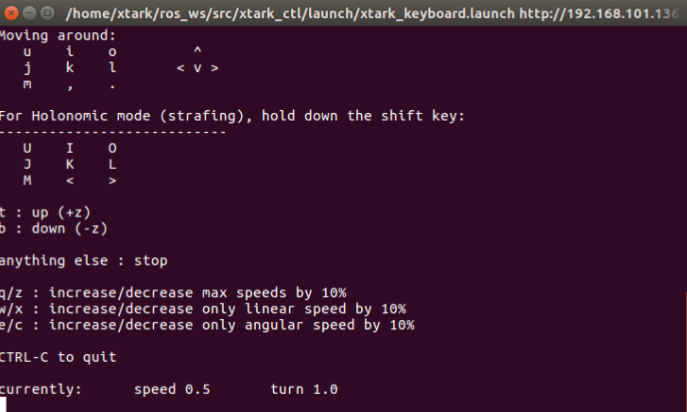
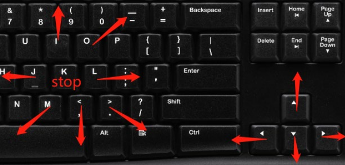
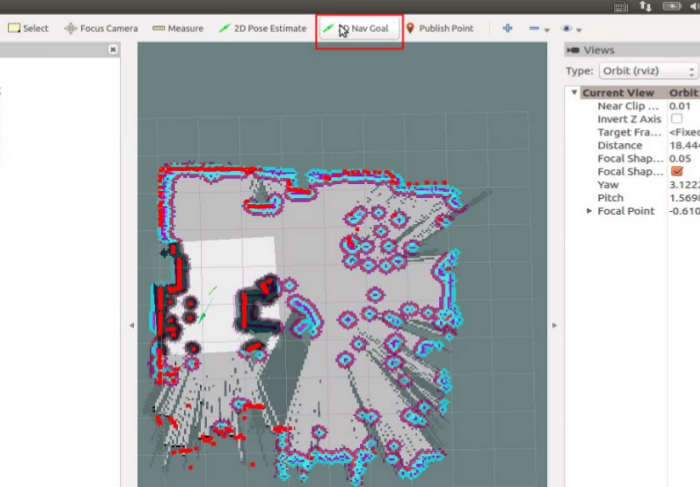
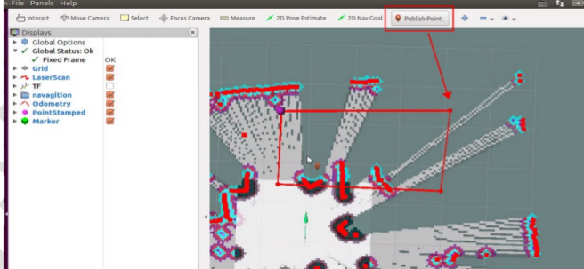
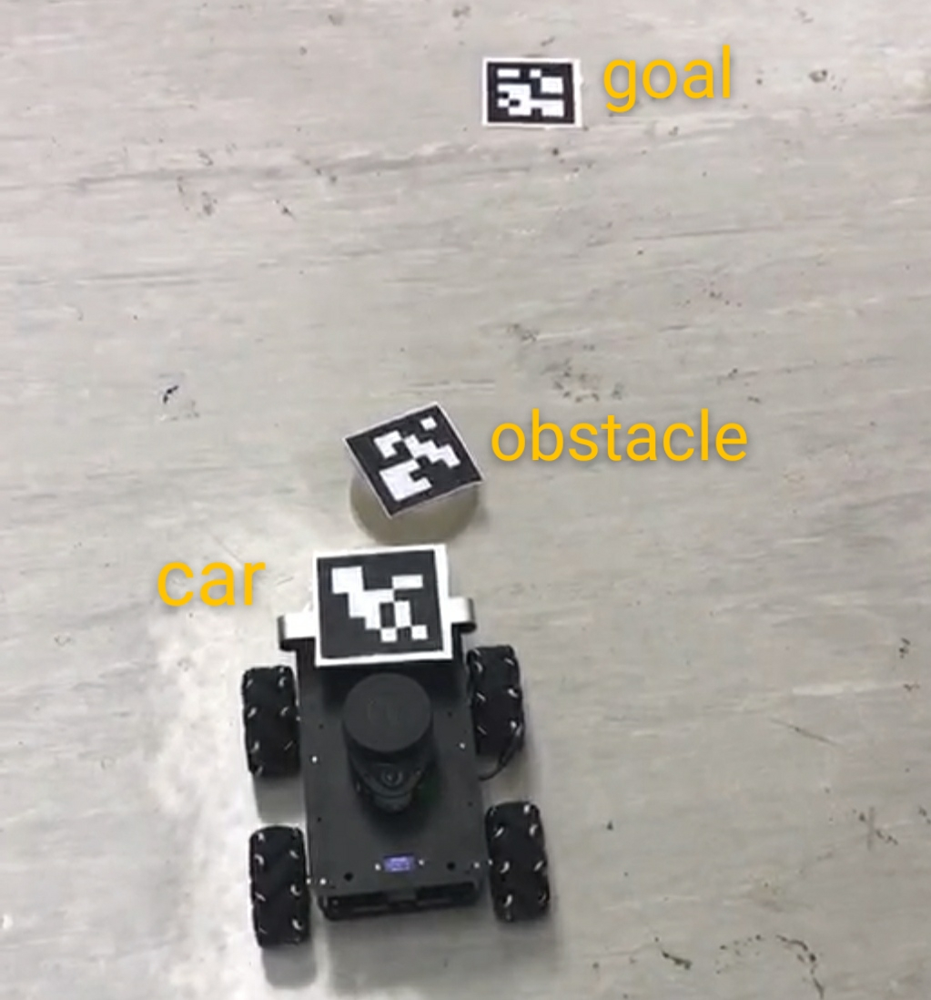

# Perceptual Robotics Lab3
In this lab, you will be learning 

* Simultaneous localization and mapping (SLAM)
* Potential field

## Part I: Simultaneous localization and mapping (SLAM)

First, run the slam package

```roslaunch xtark_nav xtark_slam.launch slam_methods:=frontier```

Then, visulaise the result :

```rosrun rviz rviz```

You need to load the configuration file. In rviz, select open config and find ```xtark_mapping.rviz```

Move the robot using any of the following three methods for mapping and navigation:

#### 1.Keyborad control

In a new terminal, run the keyboard control node

```roslaunch xtark_ctl xtark_keyboard.launch```

The terminal(left) and control(control) are like this:

  

#### 2.Using Nav goal in Rviz



#### 3.Set a region of interest using Publish Point in Rviz



You can then start to explore the environment. 


## Part II: Potential field

Now, close all the terimals using ```ctrl + C``` and we will begin a new experiment.
In this part, the car will reach the goal while avoiding the obstacles in between.
We use three AR markers to represent the car, the goal and an obstacle repectively.



To do this, you first need to launch the drvier in the car:

```roslaunch xtark_driver xtark_driver.launch```

Then, switch to the computer, execute sendmsg.py to get the position of the car, goal and obstacle:

```python sendmsg.py```

After all the markers are detected (the position array appeared in terminal), run the potential field launch file:

```roslaunch xtark_ctl potentialfieldcar.launch```

The newly launched file will receive information form sendmsg.py.
Now you can press any key to start the planning of potential field.
